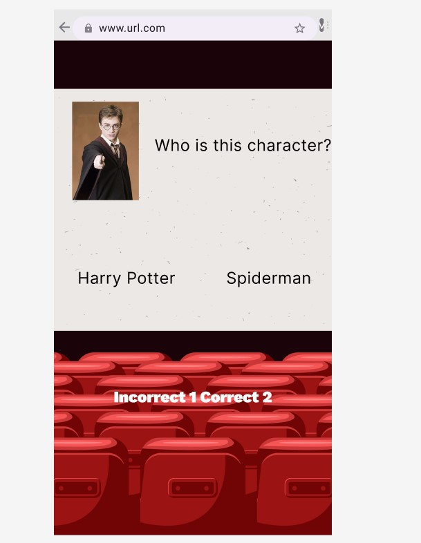
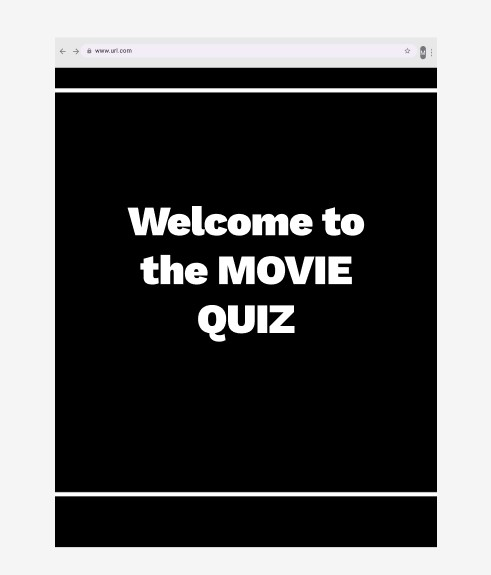

# Movie Quiz

| <a href="" target="_blank">Live Project</a> |

## Introduction

The Movie Quiz represents the first hackathon collaborative project given to us for the Code Institute Full Stack Software Developer Bootcamp. Us refers to the collaborators, Caprice, Cristian, Crystal and Yusuf 

Live project: <a href="" target="_blank">Movie Quiz</a>

<h2 align="center" id="TOC">Table of Contents</h2>

* [Movie Quiz](#moviequiz)
  - [Introduction](#introduction)
  - [Table of Contents](#TOC)
  - [Project Ouline](#project-outline)
* [Project Planning](#project-planning)
    - [UX Design](#ux-design)
      - [User Stories](#user-stories)
      - [Colors](#colors)
      - [Fonts](#fonts)
      - [Imagery](#imagery)
      - [Wireframes](#wireframes)
* [Features](#features)
  - [General Features](#general-features)
    - [Navigation and Carousel Section](#navigation-and-carousel-section)
    - [Bootstrap Cards](#bootstrap-cards)
    - [Links and Buttons](#links-and-buttons)
  - [Resnposive Design](#responsive-design)
* [Built With](#built-with)
  - [Technology and Languages](#technologies-and-languages)
  - [Libraries and Frameworks](#libraries-and-frameworks)
  - [Tools & Programs](#tools-and-programs)
* [Development](#deployment)
* [Testing](#testing)
* [Credits](#credits)
  - [Code](#code)
  - [Content Research](#content-research)
  - [Media](#media)
  - [Acknowledgements](#acknowledgements)

<a href="#moviequiz">Back To Top</a>

## Project Outline

A fun, interactive movie quiz game where players answer multiple-choice questions related to movies. The quiz will test their knowledge on various movie-related topics, such as characters and movie plots. Players will receive immediate feedback on whether their answers are correct or incorrect.

### Key Objectives
- Welcome Page: A homepage with a brief introduction and a "Start Quiz" button.
- Quiz Interface: A series of questions with multiple-choice answers (three options per question).
- Answer Feedback: Immediate feedback displayed after each answer (correct or incorrect).
- Score Tracking: Display the player’s score at the end of the quiz.
- Timer (Optional): A countdown timer for each question to add a time challenge.
- Mobile Responsiveness: The quiz will be fully responsive and work well on both mobile and desktop screens.

## UX Design

## User Stories

<a href="#moviequiz">Back To Top</a>

## Colors

We stuck to a classic colour scheme on our end, mainly using black and white, as the main background were images we pulled from online.

To ensure compliance to standards, the [Colour Contrast Checker](https://colourcontrast.cc/) (also available as extension on [Chrome Web Store](https://chromewebstore.google.com/detail/colour-contrast-checker/nmmjeclfkgjdomacpcflgdkgpphpmnfe)) was used. 
Both the [WebAIM](https://webaim.org/resources/contrastchecker/) and the [Adobe](https://color.adobe.com/create/color-contrast-analyzer) color contrast tools were used to corroborate these results.

### Main Palette
- White `#ffffff` `--white`
- Black `#000000` `--black`

[ColorContrastChecker](/documentation/images/Color%20Contrast%20Checker%201.png)
[Adobe](/documentation/images/Color%20Contrast%20Checker%202.png)
[WebAIM](/documentation/images/Color%20Contrast%20Checker%203.png)

Due to the potential impact of color on mental health, additional research and feedback was found to ensure an appropriate selection was made for this project. Additional research in the documentation [research](/documentation/research.md).

<a href="#moviequiz">Back To Top</a>

## Fonts

When looking in Google Fonts I wanted to ensure a positive user experience whilst visiting the page in which they wuld be able to clearly see the sections and headings. 
Two  fonts were selected for the project, and implemented via [Google Fonts](https://fonts.google.com) using a direct import code within the style.css file.

[Sour Gummy] (https://fonts.google.com/specimen/Sour+Gummy) is a more fun font, to add some style to the pages

[Roboto] (https://fonts.google.com/specimen/Roboto) is the primary content font ensuring content looks good and seamless

<a href="moviequiz">Back To Top</a>

### Wireframes

These wireframes were created using [Balsamiq](https://balsamiq.com/) to highlight key features in the layout that work to guide the user experience. While using a [Bootstrap](https://getbootstrap.com/) framework with its available components that allow for ease of navigation and structured content with a fully responsive design.

**Mobile Wireframe**

**Tablet Wireframe**

**Desktop Wireframes**
 
 
 
 

<a href="moviequiz">Back To Top</a>

## Imagery

The visuals for the movie quiz project combine elements that evoke a cinematic experience. The first image features an elegant, vintage-style decorative frame with intricate corner details, set against a black background. This frame suggests a classic or timeless atmosphere, possibly hinting at a traditional movie aesthetic or offering a sense of mystery and anticipation.

The second image takes inspiration from the interior of a movie theatre, showing a row of plush red cinema seats arranged in front of a blank screen. The dark, rich tones of the theater and the neutral screen create a feeling of being in the midst of a cinematic experience, setting the stage for the quiz participants to engage in the world of films.

<a href="#moviequiz">Back To Top</a>

## Features

### General Features

The criteria requested that we create and design an interactive Front-End web application using HTML, CSS and JavaScript based on the principles of user experience design, accessibility, and responsivity.

When coding the project, receiving feedback, the features and design changed from the original wireframes to be more interacctive.

Adjustments:
- added javascript to include features such as questions, scores and a timer.

#### Navigation and Carousel Section
We chose to keep the navbar simple as it isn't a main feature of this project.

#### Links and Buttons

We stuck to one colour for links and buttons based on the website background, sticking to either black or white for consistency.

<a href="#moviequiz">Back To Top</a>

### Responsive Design

<a href="#moviequiz">Back To Top</a>

## Built With

### Technologies and Languages

### Libraries and Frameworks

### Tools and Programs

<a href="#the-mental-mountain-hub">Back To Top</a>

## Deployment

This [GitHub](https://github.com/) project was created using the [Code Institute Template](https://github.com/Code-Institute-Org/ci-full-template) ensuring all necessary dependencies were included when opening within the designated workspace on the [Gitopod IDE](https://www.gitpod.io/).

Setup a repo using this method and template:
1. Login to your GitHub profile.
2. Navigate to the Code Institute Full Template
3. Click the dropdown for 'Use this template' and select "Create a new repository"
4. Generate the necessary name and description for your repo and click 'Create repository from template'
5. Navigate to the new repo and click the green 'Open' button with the Gitpod logo 
**IMPORTANT - This button should only be clicked once to generate the new IDE workspace**
6. You can now work on your repository within the Code Institute Gitpod IDE workspace

Once the project repo is created, an early deployment for the live project should performed. 
This allows for early and continuous testing using a variety of devices, as well as the Dev Tools available within browsers.

Additional information on the deployment process can be found on the official [GitHub Docs](https://docs.github.com/en/pages/quickstart)

<a href="#moviequiz">Back To Top</a>

## Testing

Testing and validation os the website was carried out throughout the course of the project.

This included regular debugging and testing using the Dev Tools as provided within Chrome Browser.

[HTML Validation](https://validator.w3.org/) 

[CSS Validation](https://jigsaw.w3.org/css-validator/) 

Any Bugs
-
-

<a href="#the-mental-mountain-hub">Back To Top</a>

## Credits

### Code

Project and primary learning supplied by [Code Institute](https://codeinstitute.net/ie/) 
Supplemental learning resources within the project:

- [Chat GPT](https://chatgpt.com/) as a learning and content creation tool, no code was directly used.

All additional sources [research](/documentation/research.md).

### Content Research

The additional [research](/documentation/research.md) is listed and can be found within the documentation folder of this repo.

### Media
- 

### Acknowledgements

<a href="#the-mental-mountain-hub">Back To Top</a>
